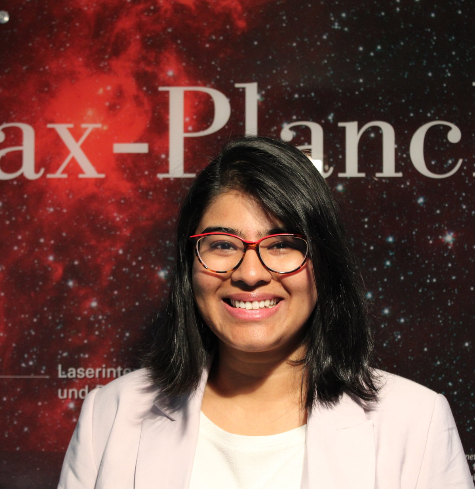

# Hi, I’m Anjana.

Welcome to my personal website!  
I work on gravitational waves, pulsars, and data science.

Currently, I work on the NANOGrav Pulsar Timing Array project where I develop methods and perform analyses to search for and detect gravitational wave signals and interesting noise sources in the observational data. 

[Here's my CV](AnjanaAshok_CV.pdf)

[Here are my publications](https://inspirehep.net/authors/1889521)

You can reach me at : ashokan@oregonstate.edu
